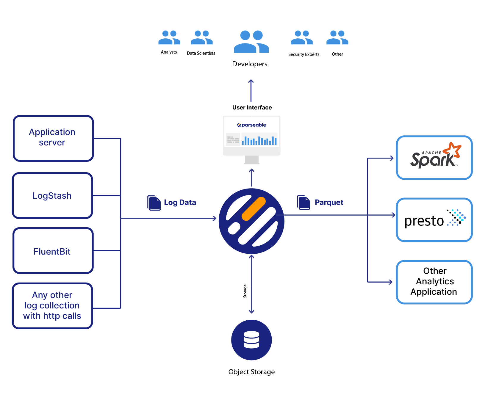

  

  
  
  
  
    
  

<h4 align="center">
  <a href="https://demo.parseable.io" target="_blank">Live Demo</a> |
  <a href="https://www.parseable.io/docs" target="_blank">Docs</a> | 
  <a href="https://www.postman.com/parseable/workspace/parseable/overview" target="_blank">Postman Workspace</a>
</h4>

Parseable is an open source, cloud native, log storage and management platform. 

Parseable helps you ingest high volumes of log data from various sources (Fluentbit, Logstash etc or directly from applications). Parseable stores log data into highly compressed Parquet file format. With object storage as primary storage for Parseable, you get seamless scale and flexibility for ever growing log data.

  

<h1></h1>

### Live Demo 

Checkout Parseable without installation.

|          |                                        |
-----------|-----------------------------------------
| Server   | https://demo.parseable.io              |
| User ID  | parseable                              |
| Password | parseable                              |

Note: Please do not store any sensitive data on this server as the data is openly available. We'll clean this server periodically.

### Why Parseable

* Indexing free design.
* Highly compressed log data in Parquet - columnar, open data format. Search logs via Parseable UI or bring your own analytics platform.
* Stateless design allowing seamless scale and flexibility.
* Own your log storage data on your object storage buckets.
* SDK less, simple REST API calls to upload logs.

### Features

* Filter log data on tags.
* Query for specific keywords and fields.
* Intuitive dashboard to parse and query through log data.
* Get started on Kubernetes with helm chart.
